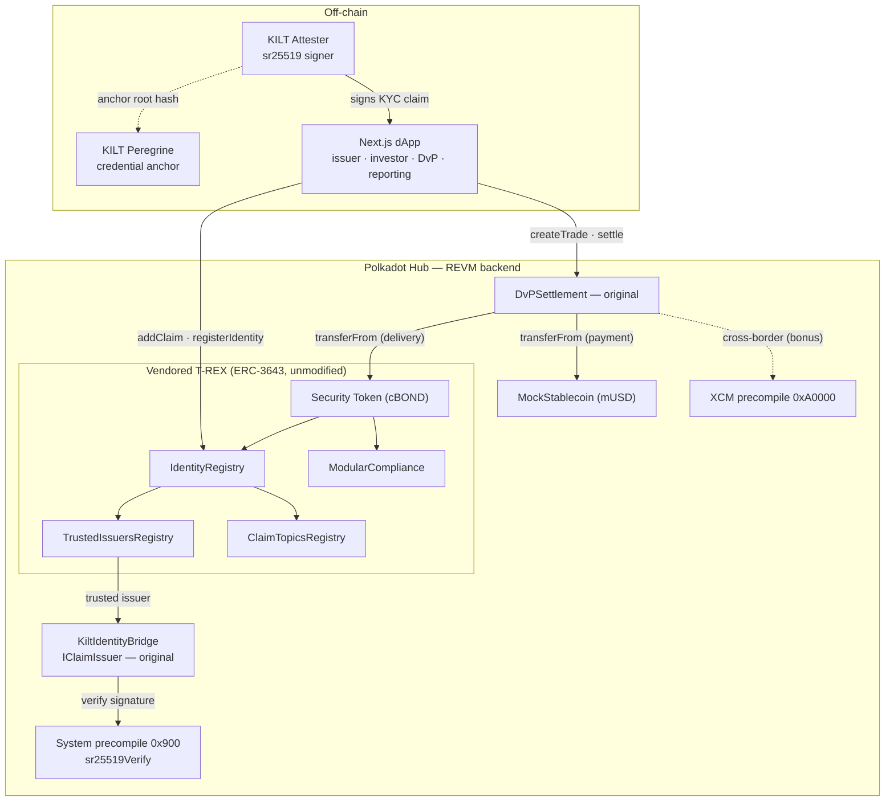
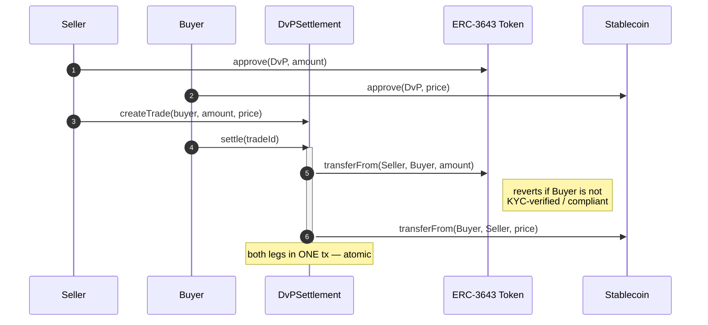
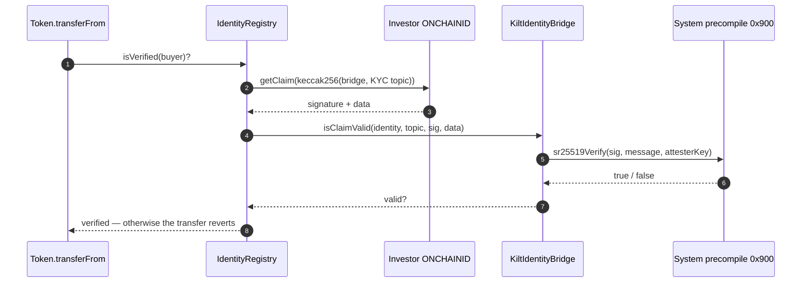
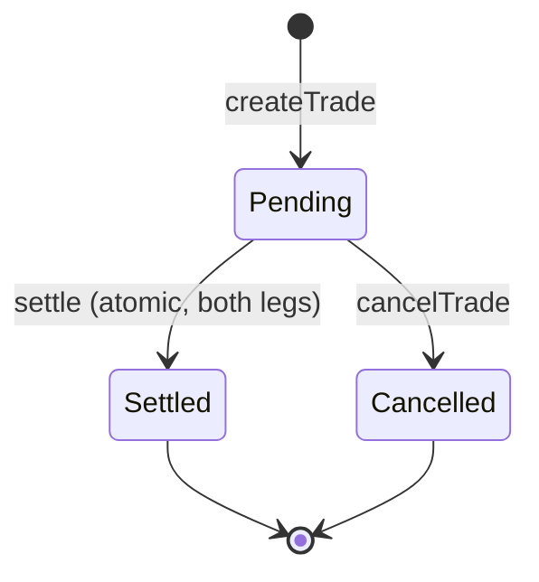

# Cowchain RWA — Compliant Issuance & Atomic DvP on Polkadot Hub

> A **reference implementation** of the full institutional lifecycle of a tokenized real-world asset (RWA)
> on **Polkadot Hub**: compliant issuance → identity-verified onboarding → automatic compliance enforcement →
> **atomic delivery-versus-payment (DvP)** settlement against a stablecoin → cross-border settlement → reporting.


-56b3fa)

[](https://github.com/cowchainworkspace/cowchain-polkadot-asset-hub-rwa-dvp/actions/workflows/ci.yml)


### ▶ Live demo

**[Open the live demo →](https://ADD-YOUR-FRONTEND-URL-HERE)** &nbsp;—&nbsp; _replace this link with your deployed frontend URL._
The contracts are already live on [Polkadot Hub TestNet](https://blockscout-testnet.polkadot.io/address/0xE407A1951f0c8C958d424A32Af9492A2090c8A94).

---

## About

[**Cowchain**](https://cowchain.io) builds compliant tokenization and settlement infrastructure for real-world
assets on Polkadot. This repository is an open-source **educational reference** — not production infrastructure —
showing the institutional RWA lifecycle (compliant issuance, on-chain identity, atomic settlement) working
end-to-end on Polkadot Hub today. The code prioritizes correctness, clarity, and well-commented readability for an
institutional audience (asset managers, banks, Polkadot entities). Every Hub/KILT/T-REX fact was verified against
current official docs (June 2026); the whole stack is **deployed and proven on Polkadot Hub TestNet**.

---

## Table of contents

- [Why this matters (business case)](#why-this-matters-business-case)
- [The two ideas worth your attention](#the-two-ideas-worth-your-attention)
- [System architecture](#system-architecture)
- [How it works (flows)](#how-it-works-flows)
- [What has been proven on-chain](#what-has-been-proven-on-chain)
- [Repository layout](#repository-layout)
- [Tech stack](#tech-stack)
- [Live deployment](#live-deployment)
- [Getting started](#getting-started)
- [The dApp](#the-dapp)
- [Testing](#testing)
- [Trust model & limitations](#trust-model--limitations)
- [Roles & privileges](#roles--privileges)
- [Production roadmap](#production-roadmap)
- [Get in touch](#get-in-touch)
- [License](#license)

---

## Why this matters (business case)

Institutions cannot touch permissionless tokens — it breaks regulatory obligations. So tokenization of trillions in
real-world assets is blocked by two things: **compliance** and **settlement risk**. This project demonstrates a clean
solution to both, natively on Polkadot Hub.

| Problem today | What this delivers |
|---|---|
| T+2 settlement via custodians, clearing houses, CSDs; reconciliation; failed-trade penalties | **Atomic DvP** — both legs in one transaction, instant, no intermediary |
| Settlement risk: one side delivers, the other doesn't ("Herstatt risk") | If anything is wrong, **nothing moves** — counterparty risk at settlement is eliminated |
| KYC repeated per platform; personal data sitting in third-party databases | **Reusable, privacy-preserving identity** (KILT) — only a cryptographic proof lives on-chain, never PII |
| Cross-chain bridges (a recurring multi-billion-dollar attack surface) | **Native cross-border settlement** via the XCM precompile — no bridge |

---

## The two ideas worth your attention

The ERC-3643 token is the audited Tokeny **T-REX** suite, vendored unmodified — it is expected baseline, not the
star. The two pieces that demonstrate the engineering are below.

### 1. Atomicity and compliance compose for free

`DvPSettlement.settle(tradeId)` performs both legs in **one transaction**:

```solidity
securityToken.transferFrom(seller, buyer, amount);  // ERC-3643: reverts if buyer is non-compliant
paymentToken.transferFrom(buyer, seller, price);    // payment leg
```

Because the ERC-3643 token's `transferFrom` **reverts** for a non-compliant buyer (failed KYC, wrong jurisdiction,
lock-up, frozen wallet), the **payment leg reverts with it**. Compliance enforcement and settlement atomicity are not
two systems bolted together — they compose automatically. We use a **direct approve-based swap** (not escrow): the
security never rests in an intermediary address.

### 2. KILT identity, verified natively on-chain

KYC is attested as a **KILT verifiable credential**, and the attester's **sr25519** signature is verified
**on-chain** using Polkadot Hub's **System precompile** (`0x0000…0900`, `sr25519Verify`). The bridge is packaged as
an ERC-3643 `IClaimIssuer`, so it plugs into the unmodified T-REX `TrustedIssuersRegistry` with **zero changes to the
audited token**. KILT's default ecdsa keys are *not* `ecrecover`-compatible (Blake2 prehash) — which is exactly why
we verify the sr25519 key via the Polkadot-native precompile. This is proven end-to-end on the live chain (a real
`@polkadot/keyring` signature returns `true`; a tampered one returns `false`).

---

## System architecture



**Legend.** *Vendored* = audited Tokeny T-REX, untouched. *Original* = Cowchain's `KiltIdentityBridge` and
`DvPSettlement`. The bridge implements only the one function the registry calls (`isClaimValid`), so T-REX needs no
modification.

---

## How it works (flows)

### Atomic DvP settlement



### On-chain KILT identity check (inside every transfer)



### Trade lifecycle



---

## What has been proven on-chain

All of this runs as real transactions on Polkadot Hub TestNet — not mocks:

- ✅ The audited T-REX suite deploys **unmodified on REVM** (every contract < 24 KB EIP-170).
- ✅ A real KILT **sr25519** signature verifies on the live System precompile `0x900` — `true` for a valid signature,
  `false` for a tampered one (`pnpm --filter @cowchain/kilt probe`).
- ✅ The complete lifecycle settles on-chain: KILT-verified onboarding → issuance → **atomic DvP**, and a mint to a
  non-verified address **reverts** (`pnpm --filter @cowchain/kilt demo`).
- ✅ The XCM precompile `0xA0000` is live and callable (`pnpm --filter @cowchain/kilt probe:xcm`).
- ✅ 31 Foundry tests pass, including a **full-stack integration test** that deploys the real T-REX + bridge and
  proves `isVerified` routes through the bridge and DvP composes with real ERC-3643 compliance.

---

## Repository layout

```
cowchain-rwa-dvp/
├─ .github/workflows/             CI — forge fmt/build/test + web build (push & PR)
├─ apps/
│  └─ web/                         Next.js 15 dApp (issuer / investor / DvP / reporting)
├─ packages/
│  ├─ contracts/                   Foundry (forge nightly)
│  │  ├─ src/
│  │  │  ├─ trex/                   vendored Tokeny T-REX (ERC-3643), UNMODIFIED
│  │  │  ├─ KiltIdentityBridge.sol  ★ original — sr25519 verified via 0x900, as an IClaimIssuer
│  │  │  ├─ DvPSettlement.sol       ★ original — atomic delivery-versus-payment
│  │  │  ├─ MockStablecoin.sol      simple ERC-20 cash leg
│  │  │  └─ precompiles/            ISystem.sol (0x900), IXcm.sol (0xA0000)
│  │  ├─ script/DeployTREX.s.sol    deploy + wire the whole stack
│  │  ├─ test/                      31 tests (unit + integration/FullStack.t.sol)
│  │  └─ deployments/               hub-testnet.json (live addresses)
│  └─ kilt/                         off-chain KILT attester (TypeScript)
│     └─ src/                       keygen · probe · probe-xcm · claim · demo
└─ README.md
```

---

## Tech stack

| Layer | Choice |
|---|---|
| Monorepo | Turborepo + pnpm |
| Contracts | Foundry **nightly** (`forge ≥ 1.6.0-nightly`), Solidity `0.8.17` |
| Security token | Tokeny **T-REX 4.1.6** (ERC-3643) + **ONCHAINID 2.2.1**, OpenZeppelin **v4.8.3** |
| Execution backend | **REVM** (runs unmodified EVM bytecode; not the PVM/resolc path) |
| Identity | **KILT** — `@kiltprotocol/sdk-js`, `@polkadot/keyring` (sr25519) |
| On-chain crypto | Polkadot Hub **System precompile 0x900** (`sr25519Verify`) |
| Cross-border | Polkadot Hub **XCM precompile 0xA0000** (`IXcm`) |
| Frontend | Next.js 15 (App Router) · TypeScript · Tailwind · **viem + wagmi** |

---

## Live deployment

Polkadot Hub TestNet — chain id **420420417**, native token **PAS**, RPC `https://eth-rpc-testnet.polkadot.io/`,
explorer [blockscout-testnet.polkadot.io](https://blockscout-testnet.polkadot.io/). Full set in
[`packages/contracts/deployments/hub-testnet.json`](packages/contracts/deployments/hub-testnet.json).

| Contract | Address |
|---|---|
| Security Token (cBOND) | [`0x60670D…5E3B`](https://blockscout-testnet.polkadot.io/address/0x60670D2680D3F08139a0D8F48de8aC00aB5D5E3B) |
| **DvPSettlement** ★ | [`0xE407A1…8A94`](https://blockscout-testnet.polkadot.io/address/0xE407A1951f0c8C958d424A32Af9492A2090c8A94) |
| **KiltIdentityBridge** ★ | [`0xc05e4C…07f41`](https://blockscout-testnet.polkadot.io/address/0xc05e4C1c314049f5396B8dE35E8052Af72d07f41) |
| MockStablecoin (mUSD) | [`0xD17320…63dF`](https://blockscout-testnet.polkadot.io/address/0xD1732088b8eCedB3639327785f23187FB46663dF) |
| IdentityRegistry | [`0x9abDdc…e321`](https://blockscout-testnet.polkadot.io/address/0x9abDdcd65a59F78cdf49F87E706D89F919a3e321) |
| ModularCompliance | [`0xE36879…dE67a`](https://blockscout-testnet.polkadot.io/address/0xE36879fd099f8e270b3719924f743A36436dE67a) |
| TrustedIssuersRegistry · ClaimTopicsRegistry · IdentityRegistryStorage | see deployments JSON |

---

## Getting started

> Prerequisites: Node ≥ 20, pnpm ≥ 9, and Foundry **nightly** (`forge ≥ 1.6.0-nightly`).

```bash
pnpm install
cp .env.example .env                          # fill HUB_DEPLOYER_PRIVATE_KEY (or: cast wallet new)

# Contracts
pnpm --filter @cowchain/contracts build       # compile (Foundry nightly)
pnpm --filter @cowchain/contracts test        # 31 tests (unit + full-stack integration)
forge script DeployTREX --root packages/contracts --rpc-url $HUB_TESTNET_RPC_URL --broadcast --slow

# KILT off-chain attester
pnpm --filter @cowchain/kilt keygen           # generate the sr25519 attester key
pnpm --filter @cowchain/kilt probe            # prove sr25519 verifies on 0x900 (live)
pnpm --filter @cowchain/kilt probe:xcm        # prove the XCM precompile is live
pnpm --filter @cowchain/kilt demo             # full onboarding -> issuance -> atomic DvP, on-chain

# Web dApp
pnpm --filter @cowchain/web dev               # http://localhost:3000
```

Testnet keys are generated locally and funded via the faucets ([PAS](https://faucet.polkadot.io/),
[PILT](https://faucet.kilt.io/)); they live only in the gitignored `.env`.

---

## The dApp

A connected-wallet dashboard (wagmi/viem) with network guards (auto-prompts a switch to Polkadot Hub):

| Tab | What it does |
|---|---|
| **Issuer** | Live token info, compliance config, and a **mint** form (gated on the agent role + a KYC-verified recipient) |
| **Investor** | Wallet KYC status, holdings (cBOND / mUSD / PAS), and a stablecoin faucet |
| **Trade (DvP)** | Create a trade, approve your leg, and **settle** atomically — the full lifecycle, clickable |
| **Reporting** | Total supply, settlement ledger of every DvP trade, and settled counts |

---

## Testing

31 Foundry tests, run on a local EVM (Anvil). The 0x900 precompile is mocked in unit tests; end-to-end sr25519
verification against the real precompile is proven by the `packages/kilt` scripts on the live testnet.

| Suite | Tests | Proves |
|---|---|---|
| `DvPSettlement.t.sol` | 16 | atomicity, compliance-revert composition, reentrancy safety, expiry, cancel, `canSettle` |
| `KiltIdentityBridge.t.sol` | 11 | signature soundness, replay binding, expiry/revocation, message-reconstruction pin |
| `integration/FullStack.t.sol` | 4 | the **real** T-REX + bridge: `isVerified` routes through the bridge; DvP composes with real compliance |

---

## Trust model & limitations

We state honestly what is and isn't trustless today:

- KILT verification is fundamentally a **chain lookup** (recompute the credential root-hash → confirm the attestation
  exists and isn't revoked on the KILT chain). A presentation carries the *holder's* control signature, not a reusable
  issuer signature an EVM contract could check alone.
- A smart contract can only read its **own** chain's state synchronously, and the contract lives on a different chain
  than KILT. Verifying KILT's current state trustlessly would require a light-client / state-proof inside the EVM —
  for which Hub exposes neither a relay-state-root precompile nor ed25519. XCM is asynchronous, so it can't answer a
  synchronous in-transfer check.
- **What we do:** verify the attester's **sr25519 signature on-chain** over `(chainid, bridge, identity, topic, data)`
  — a genuine, Polkadot-native cryptographic check that binds the claim to this chain, bridge, investor and topic.
  Credential **liveness/revocation** is handled by an off-chain watcher that can call `revokeCredential`.

The production path (KILT DIP light-client / KILT's forthcoming EVM SDK / XCM to People Chain) is documented as future
work — see [Production roadmap](#production-roadmap).

---

## Roles & privileges

In this reference deployment **all admin power sits on the single deployer key** — fine for a showcase, but production
must split these across a multisig + timelock:

| Capability | Holder | Can do |
|---|---|---|
| Owner of token / registries / compliance | deployer | set trusted issuers, claim topics, compliance modules |
| Agent of Token + IdentityRegistry | deployer | mint, freeze, forced-transfer, register/remove identities |
| Owner of `KiltIdentityBridge` | deployer | trust/untrust attester keys, revoke credentials |
| MANAGEMENT key of each investor ONCHAINID (demo) | deployer | add/remove keys & claims on investor identities |

The one thing the operator **cannot** do is forge the attester's sr25519 signature. The bridge uses `Ownable2Step` and
disables `renounceOwnership` to avoid admin-loss footguns.

---

## Production roadmap

- **Identity:** move credential liveness/revocation on-chain via KILT **DIP** (light-client / state proofs) or KILT's
  EVM SDK once shipped; give each investor the MANAGEMENT key of their own ONCHAINID.
- **Governance:** put owners behind a multisig + timelock; use dedicated, rotated agent keys.
- **Settlement:** real regulated stablecoin for the cash leg; curated `paymentToken` allowlist.
- **Cross-border:** complete the XCM cash leg to a counterparty parachain (the precompile is already proven live).

---

## Get in touch

- 🌐 Website — [cowchain.io](https://cowchain.io)
- 📫 Email — [dev@cowchain.io](mailto:dev@cowchain.io)
- 💼 LinkedIn — [Cowchain](https://www.linkedin.com/company/cowchaindev/)

---

## License

GPL-3.0 — inherited from the vendored Tokeny T-REX suite. See [LICENSE](LICENSE) and
[`src/trex/LICENSE.md`](packages/contracts/src/trex/LICENSE.md).

---

<sub>Reference implementation by **Cowchain**. Not audited; not for production use.</sub>
